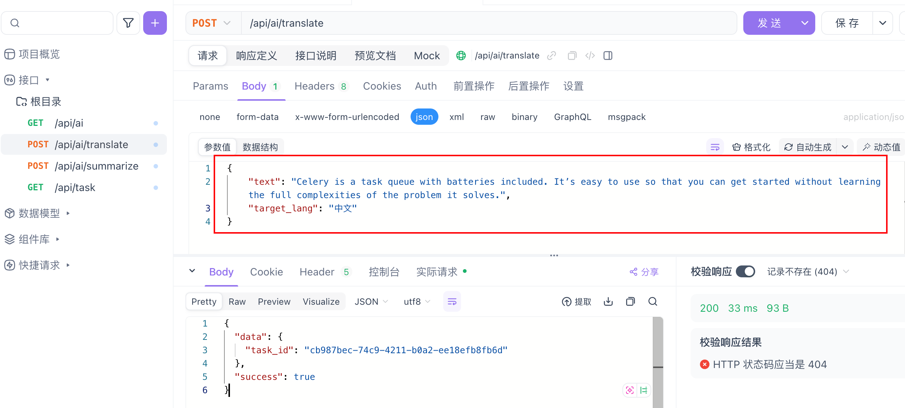
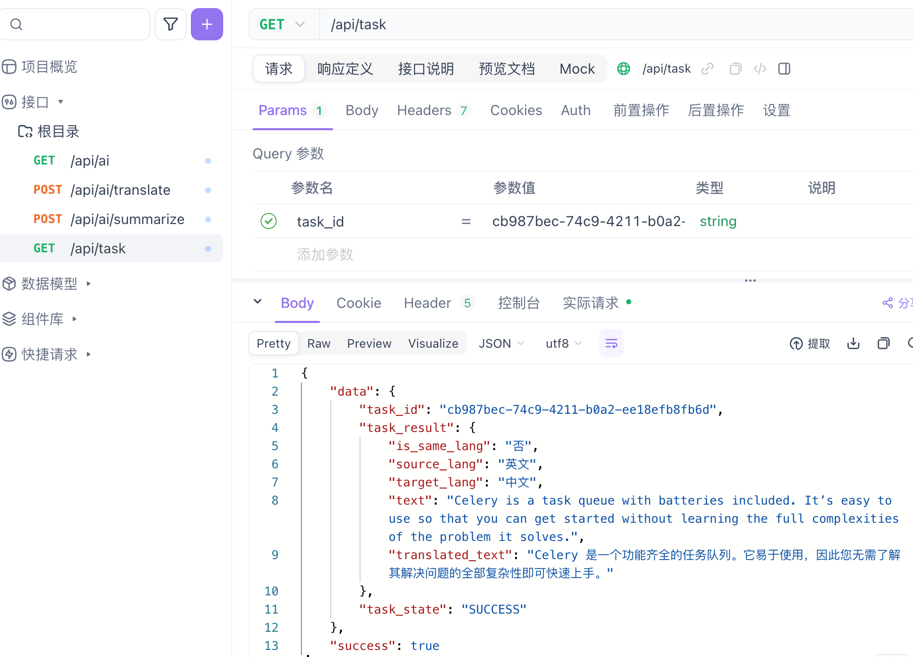
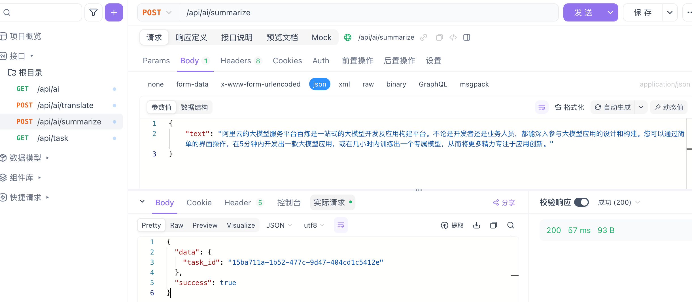
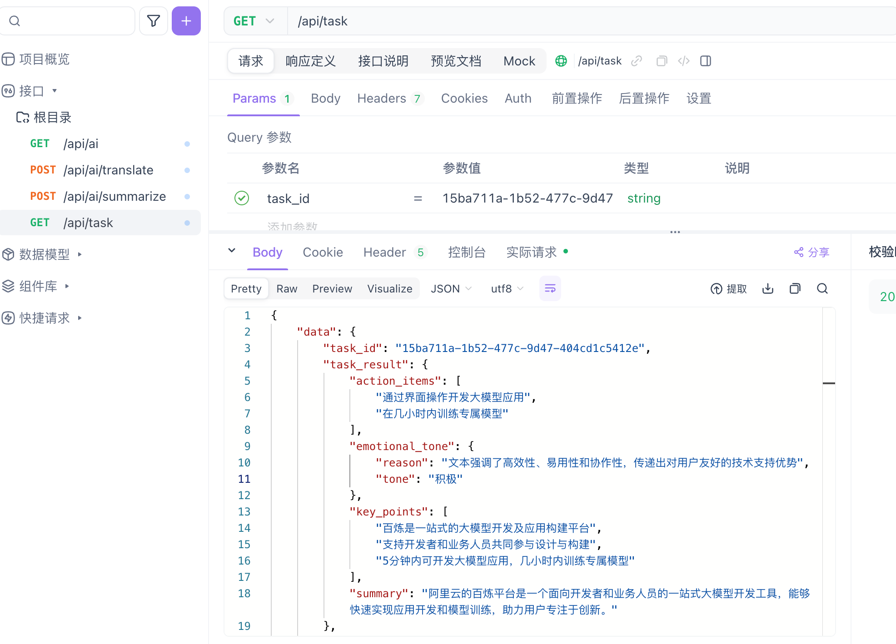

# Ai应用Demo

## 项目简介

一个Ai应用的后端演示项目，提供Ai翻译、Ai总结功能接口，支持客户端异步调用，轮询结果

## 快速开始

运行

```bash
# 创建环境
conda create --name ai_demo python=3.9 -y
conda activate ai_demo
pip install -r requirements.txt
# 启动redis
docker run -d -p 6379:6379 --name some-redis redis
# 启动Celery Worker
celery -A tasks.celery worker --loglevel=info
# 启动Flask
python app.py
```

删除

```bash
# 移除redis
docker stop some-redis | docker rm some-redis
# 移除环境
conda remove -n ai_demo --all
```

## 技术架构

- LangChain：使用LCEL构建执行链，用于构建基于LLM的应用程序框架
- Celery + Redis：分布式任务队列系统，支持异步任务
- Flask：提供API接口

## 主要接口

- `/api/ai`：获取ai应用列表，展示每个ai应用的路由、请求参数、描述等信息
- `/api/ai/<id>`：根据id和调用Ai应用，返回任务id
- `/api/task`：根据任务id获取任务状态或执行结果

## 功能演示

### 演示翻译功能







### 演示总结功能





